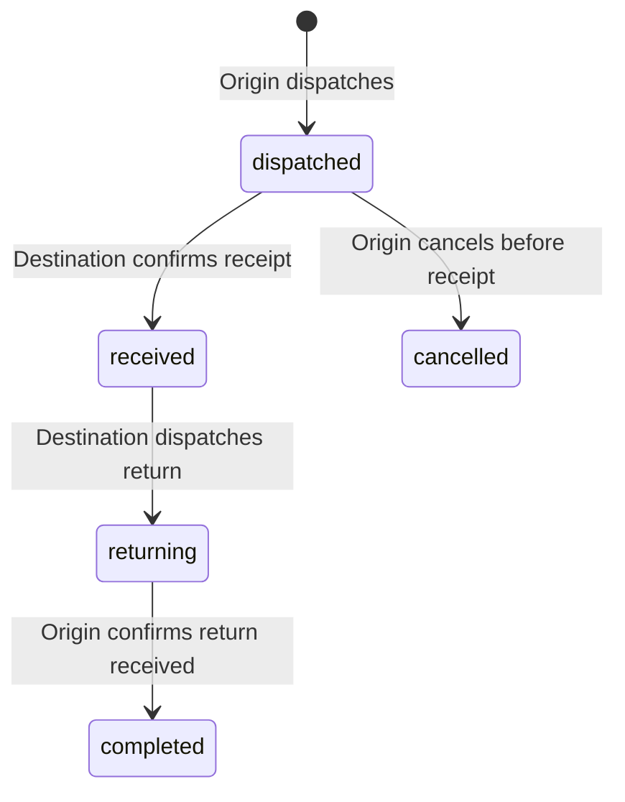

# Store hierarchy and multi-store operations

Status: MERGED — accepted and merged at `9753435` with explicit user approval. Both Render services are live on that commit; health, authentication and published handoff page/bundle checks passed. See [deployment status](../DEPLOYMENT_STATUS.md).
Priority: P1 — selected after PR #3.
PR: https://github.com/mahendraek/FabClean-SaaS/pull/5
Implementation branch: `codex/pr-5-store-hierarchy`, based on accepted main `47e67a9`.
Implementation commit: `324e911`. Publication updates `roadmap/store-hierarchy` with a normal push; GitHub API metadata editing remains blocked by `Forbidden`.

## Design and delivered behavior

Brand administrators manage regular stores, mother/hub stores, central plants and pickup/drop-off locations. Store creation and updates validate type, required names/codes, immutable brand identity, active same-brand ancestor paths and cycles. A brand-scoped transaction lock serializes competing hierarchy changes. The UI shows full hierarchy paths and excludes the edited store and its descendants from parent choices.

Staff continue to use the existing brand/store role assignment workflow. Assignments to inactive or foreign-brand stores are rejected. Store-scoped roles cannot administer the brand hierarchy or grant broader roles. An operational user can route a handoff to any active store in the same brand; this does not grant access to switch into that store or read its customer/order records.

A handoff records physical custody; it does not reassign an order's ownership. Customer data, payments, order totals, photos, private notes and catalog IDs remain at the originating store. The destination receives only an immutable work manifest (service names, quantities/units and item barcodes), originating order reference, route, explicitly shared handoff notes and custody events.

The receiving store can work from the manifest and update custody through the handoff screen; it cannot edit the originating order through general order endpoints. This PR does not introduce cross-store customer sharing, consolidated finance, catalog inheritance or detailed plant production scheduling.

## Storage and authorization

- Incremental migration `store-operations-v1` runs after the existing isolation migration, under the initialization transaction/advisory lock. It also runs on existing databases where the original migration marker causes legacy initialization to return early. Repeated startup is safe; no operational rows are reseeded.
- New `store_handoffs` has forced PostgreSQL RLS. SELECT/UPDATE see only the selected brand and one of the two named participant stores; INSERT requires the selected source store. No DELETE policy exists. Empty scope, unrelated stores and foreign brands see no handoff rows, including for the table-owner role.
- Same-brand source/destination and source-owned order relationships use composite foreign keys. Existing orders/customers retain the original store-isolation policies.
- Handoff identity, route and work manifest cannot be rewritten. A database trigger validates custody transitions and append-only event history. Events include authenticated staff, acting store, UTC timestamp and explicitly shared notes.
- A partial unique index permits only one open handoff per order. Brand-scoped locks and row locks serialize dispatch/receipt races; stale or duplicate actions return conflict instead of adding a second event.
- Store counters are updated transactionally by a trigger. Brand administrators can see open-handoff counts and reject deactivation without broadening operational RLS to every store in the brand. Active children also prevent parent deactivation.
- A database order trigger blocks item changes and ready/closed/cancelled states while custody is open; payment and ordinary private-note handling remain with the originating store. Return or cancel custody before changing items or closing the order.
- Existing invalid historical hierarchy/type rows are preserved by `NOT VALID` constraints; new writes are checked. Administrators must repair historical bad paths before reusing them. The migration does not silently reparent stores.
- Full cross-store custody/store administration requires PostgreSQL. The single-store memory demo returns empty handoff/destination lists and a clear 503 for unsupported writes.

## User flow and API

Open **Orders → Store handoffs**. Select a local open order with items, choose an active destination, add optional shared notes and review/confirm dispatch. At the destination, confirm receipt and dispatch the return. At the origin, confirm returned custody. Each action requires a confirmation and preserves history; open/closed filters, search and refresh are available on web/mobile. Cancelling a dispatch is only available at its origin before receipt.

- `GET /api/handoff-destinations`: minimal directory of other active stores in the selected brand.
- `GET /api/handoffs`: participant-scoped custody history.
- `POST /api/handoffs`: dispatch using `order_id`, `destination_store_id`, optional shared `notes`.
- `POST /api/handoffs/{id}/actions`: `receive`, `return`, `complete` or `cancel`, with optional shared notes.

## Validation

- 38 backend tests pass without skips, including legacy migration, PostgreSQL owner-role RLS, unchanged tenant isolation, safe manifests, hierarchy/type/parent/deactivation checks, scoped staff assignments, custody transitions, order-custody guards and concurrent dispatch/receipt/hierarchy edits.
- 12 frontend unit tests pass: prior session/selection tests plus descendant filtering, hierarchy breadcrumbs and historical-cycle termination.
- Desktop and mobile-web Chromium checks run against a real local PostgreSQL-backed API: confirmation back/cancel, dispatch, destination receipt, return, origin closure and persistence after refresh. Prior PR #3 switcher browser regression checks also pass.
- Expo web export passes 27 routes, including the handoff screen. TypeScript has the same 34 baseline diagnostics, with no new errors after regenerating Expo route declarations.
- Native devices/emulators and authenticated production custody flows have not been exercised. Deployment started successfully with the incremental migration; production schema contents were not independently queried. No production test fixtures or custody data writes were performed. Physical bag/barcode operations require an operator acceptance check before deployment.

Backend: run `python -m unittest discover -s tests -v` from `backend`, with `FABCLEAN_TEST_DATABASE_URL` pointing explicitly to a disposable database owned by a NOSUPERUSER NOBYPASSRLS role. Never use production fixtures.

Frontend: `npm run test:unit`; web export; then `npm run test:context:browser` and `npm run test:handoffs:browser`. Install Playwright Chromium or set `CHROMIUM_EXECUTABLE`.

For the real-API browser suite, prepare fixtures from `backend` with `python -m tests.create_handoff_browser_fixture /tmp/pr5-browser-fixture.json` and the disposable test database variable. Start a local API with `DATABASE_URL` set to that same disposable database, port 8005. The browser runner defaults to `http://127.0.0.1:8005` and that fixture file; override through `HANDOFF_TEST_API` / `HANDOFF_TEST_FIXTURES`. It refuses non-local API hosts and does not contact production.

## Boundaries

Only `mahendraek/FabClean-SaaS` is changed. PR #4 isolation and PR #3 context switching remain intact. The original planning branch is retained in ancestry for a normal PR #5 update. The user explicitly authorized this merge and deployment. PR #6 is next after acceptance; no other roadmap feature is implemented here.
